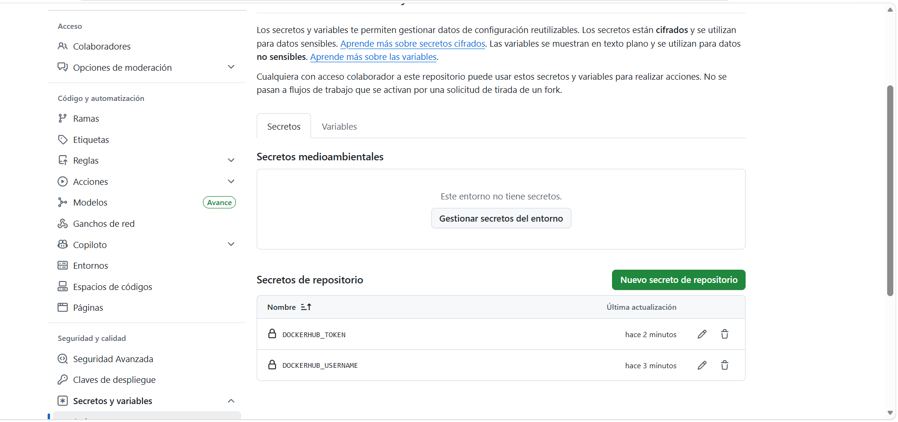
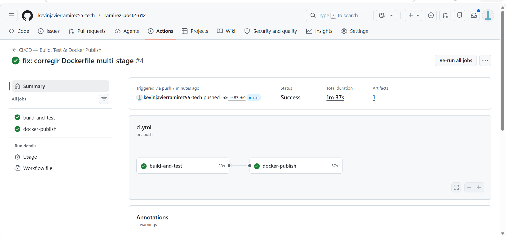
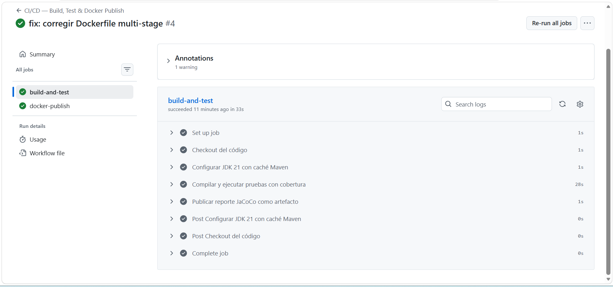
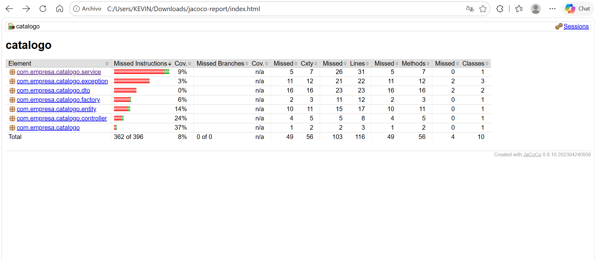
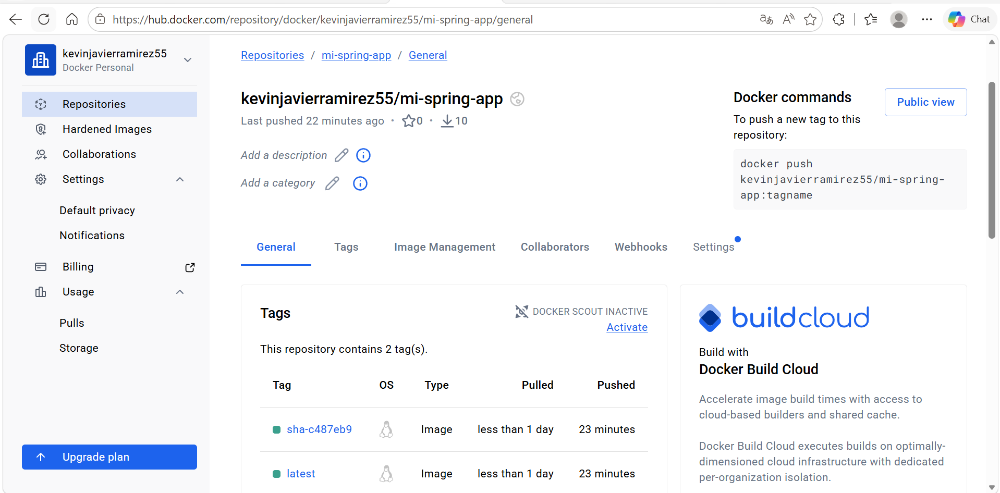
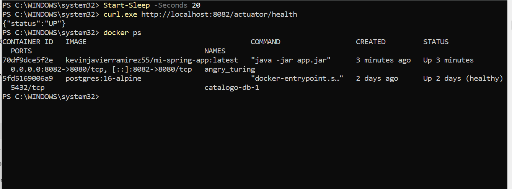

# Programacion Web - Unidad 12

## Post-Contenido 2 - Pipeline CI/CD con GitHub Actions y Docker Hub


---

## Autor

- Nombre: Kevin Ramirez
- Programa: Ingenieria de Sistemas
- Asignatura: Programacion Web
- Unidad: 12 - Despliegue y CI/CD
- Actividad: Post-Contenido 2
- Proyecto: ramirez-post2-u12

## Objetivo

Diseñar e implementar un pipeline de integración y entrega continua (CI/CD) con GitHub Actions que automatiza compilación, pruebas con cobertura JaCoCo, construcción de imagen Docker multi-stage, y publicación en Docker Hub.

## Tecnologias

- Java 21
- Spring Boot 3.2.5
- Maven Wrapper
- JaCoCo 0.8.10 
- Docker multi-stage build
- GitHub Actions
- Github
- Docker Hub
- PowerShell

# Arquitectura del Pipeline CI/CD

El workflow se ejecuta automáticamente en cada:

- `push` sobre la rama `main`
- `pull_request` hacia la rama `main`

El pipeline está compuesto por dos jobs principales:

## 1. `build-and-test`

Este job realiza:

- Descarga del código fuente
- Configuración de Java 21
- Compilación del proyecto
- Ejecución de pruebas unitarias
- Generación del reporte JaCoCo
- Publicación del reporte como artifact

## 2. `docker-publish`

Este job se ejecuta únicamente si el primero finaliza correctamente.

Realiza:

- Login automático en Docker Hub
- Construcción de imagen Docker multi-stage
- Generación de tags automáticos
- Publicación de imagen en Docker Hub

---

### GitHub Secrets Requeridos

Los siguientes secrets deben configurarse en Settings → Secrets and variables → Actions:

| Secret | Descripción | Valor |
| --- | --- | --- |
| `DOCKERHUB_USERNAME` | Usuario de Docker Hub | Nombre de usuario |
| `DOCKERHUB_TOKEN` | Access Token de Docker Hub | Token generado en hub.docker.com |

### Flujo del Pipeline

```
┌─────────────────┐
│ Push a main     │
└────────┬────────┘
         │
         ▼
┌─────────────────────────────┐
│ Job 1: build-and-test       │
│  • Maven compile            │
│  • Maven test               │
│  • Generate JaCoCo report   │
│  • Upload artifact (7 days) │
└────────┬────────────────────┘
         │
         ▼(if successful)
┌─────────────────────────────────┐
│ Job 2: docker-publish           │
│  • Login to Docker Hub          │
│  • Build Docker image           │
│  • Push with tags:              │
│    - latest                     │
│    - sha-<commit>               │
└─────────────────────────────────┘
```

## Configuración

### 1. Crear Access Token en Docker Hub

1. Ir a hub.docker.com y iniciar sesión
2. Account → Settings → Security
3. "New Access Token"
4. Seleccionar permisos: Read & Write
5. Copiar el token generado (no se puede recuperar después)

### 2. Agregar Secrets a GitHub

1. Repositorio → Settings → Secrets and variables → Actions
2. Crear `DOCKERHUB_USERNAME` con el usuario de Docker Hub
3. Crear `DOCKERHUB_TOKEN` con el token generado

### 3. Archivo del Workflow

El archivo `.github/workflows/ci.yml` define el pipeline completo.

## Ejecución Manual

Para ejecutar el pipeline, simplemente hacer push a la rama `main`:

```powershell
git add .
git commit -m "feat: implementar pipeline CI/CD"
git push origin main
```

## Características implementadas

- Imagen base Java 21
- Compilación separada en etapa builder
- Imagen final ligera con JRE
- Usuario no root
- Exposición del puerto 8080

---

## Verificación

### En GitHub Actions:

1. Ir a Actions → CI/CD — Build, Test & Docker Publish
2. Ver el estado del workflow en ejecución
3. Ambos jobs deben completar con check verde ✓

### En Docker Hub:

1. Ir a hub.docker.com/r/<usuario>/mi-spring-app
2. Verificar que la imagen fue publicada
3. Tags visibles: `latest` y `sha-<commit>`

### Descargar la Imagen

```powershell
docker pull <usuario>/mi-spring-app:latest
docker run -p 8080:8080 -e SPRING_PROFILES_ACTIVE=dev <usuario>/mi-spring-app:latest
```

## Artefactos del Pipeline

- **JaCoCo Report**: Descargable en Actions → workflow → Artifacts (retenido 7 días)
- **Docker Image**: Disponible en Docker Hub (repositorio público)

## Badge de Estado

Agregar al README principal:

```markdown

```

## Repositorio

```text
https://github.com/kevinjavierramirez55-tech/ramirez-post2-u12
```

## Capturas del Proyecto

Las capturas se encuentran en la carpeta `evidencias/`.

### Secrets DOCKERHUB_USERNAME y DOCKERHUB_TOKEN creados



### Jobs build-and-test y docker-publish pasados



### Logs maven de job




### Reporte de jacoco



### Tags y repo de Docker Hub



### Docker pull exitoso imagen publicada



